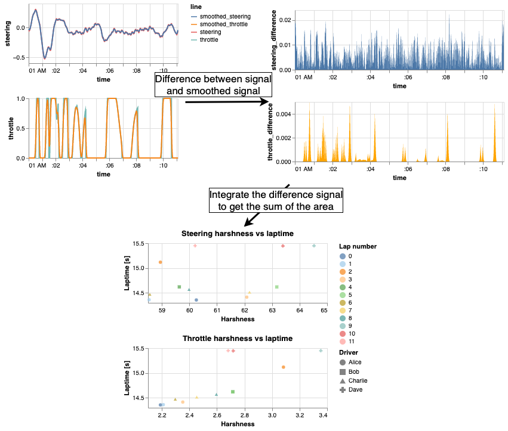
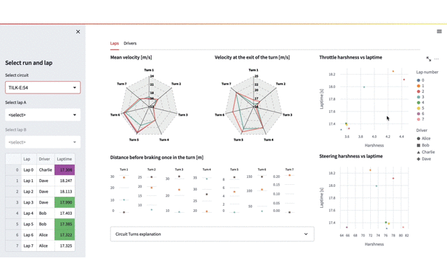
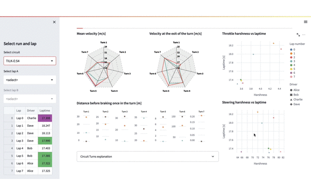
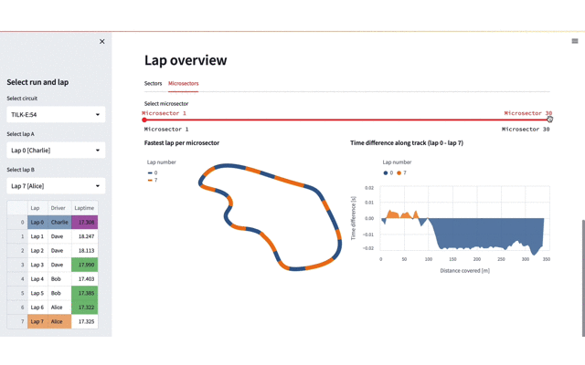
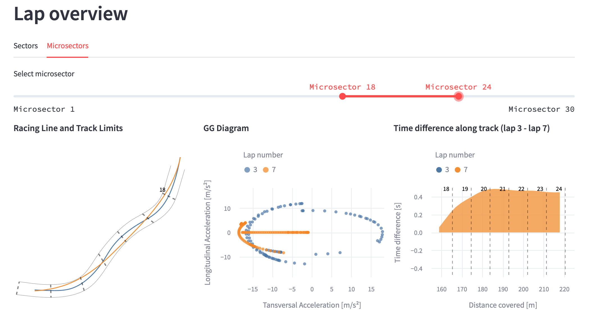

# Driver Performance Analytics (DPA)
## Driving data visual analysis tool for Formula Student teams :bar_chart: :chart_with_upwards_trend: :racing_car: :checkered_flag:

Formula Student teams not only need to build the best car to win competitions but also need to select and train their top drivers. In this repository, we propose a visual analysis application for the data collected by the car during driving, aiming to evaluate and compare the drivers. This tool has resulted in an improvement in terms of user-friendliness, communication, and interpretability of the data. Thus, decisions regarding the selection of team drivers can now be done data-driven.


## Run Locally

Clone the project and go to the project directory

```bash
git clone https://github.com/PauMatas/DPA-visual-analytics-tool
cd my-project
```

Install dependencies

```bash
pip install -r requirements.txt
```

Start the application

```bash
streamlit run app.py
```


## Usage

To use the application you need to have the data in the data folder. The data can be of three types: provided simulated example data, simulated data or real data.

The repository already contains simulated data to test the application. If you want to simulate your own data, you can do it with the `generate_data.py` script. In this script, we simulate the circuits with [TILK-E](https://github.com/puigde/TILKE), and for the different racing lines and drivers, we use our planner which is private.

> **_NOTE:_**   
You can choose how many runs are simulated running the script with the `n_circuits` variable:   
    ```
    python3 generate_data.py -n 10
    ```

If you choose to use your own real data, save it as csv files in the data folder. The data must have the following columns:
| Column name | Description |
| :-------- | :------- |
| TimeStamp | ROS internal clock time in seconds |
| Throttle | Throttle position in percentage |
| Steering | Steering position in radians |
| VN_ax | Acceleration in x-axis in m/s^2 |
| VN_ay | Acceleration in y-axis in m/s^2 |
| xPosition | Position in x-axis in m |
| yPosition | Position in y-axis in m |
| zPosition | Position in z-axis in m |
| Velocity | Velocity in m/s |
| laps | Lap number |
| dist1 | Distance covered since last row |
| BPE | Brake pressure in bar |
| sector | Current sector |
| microsector | Current microsector |

> **_NOTE:_**   
If you decide to use real data remember to save it in the expected format, shown in this [directory](/data). Splited by circuits and with the `turns.json` and `info.json` files.

## Examples

Some of the features of the application are shown below.

### Harshness chart

One of the charts that we have developed is the harshness chart. This chart shows the harshness of the drivers' driving with the analysis of the throttle and steering. The chart also intends to allow comparison between drivers' harshness and to allow detection of driving styles.

The harshness metrics are calculated as follows:



And can be seen in the right part of the application's _Run Overview_ panel:



### Lap selection

For our application it is crucial to be able to compare laps -whether they are from the same driver or not-. For this reason, we have developed a lap selection tool that allows the user to select the laps that he wants to compare. When laps are selected, the _Lap Overview_ panel view changes:



### Lap overview panel with a microsector range selected

When two laps are selected and we select a range of microsectors (as shown in the gif below), the _Lap Overview_ panel shows the comparison of the selected microsectors. This allows the user to compare the racing lines, the accelerations suffered by the car and the time difference between the two laps.



This _Lap overview_ example (shown below)gives a big amount of information to both the team and the drivers. It tells the team that the orange driver is capable to choose a better racing line which allows to gain 0.4s to the other driver in just three turns. Apart from that, it tells the team that the orange driver is capable to push more the car to its limits (as seen in the GG Diagram). Finally, it also tells the team that if the orange driver is able to go through three corners with only one steering wheel turn, he might have a better cornering ability.   
On the other hand, this Lap overview section tells the blue driver that the car limits can be pushed more and that the three corners can be surpassed with a more efficient racing line.   
In a more subtle way, the orange driver can see that in the last microsectors of this range he loses a bit of time advantage (as seen in the time difference chart). It can mean that the blue driver goes out of the last turn with more velocity and in an hypothetical long straight after the last turn the blue driver might gain advantage.



## Contributing

Contributions are always welcome! :smiley:

See [`contributing.md`](contributing.md) for ways to get started.

Contact me at [`pau.matas@estudiantat.upc.edu`](mailto:pau.matas@estudiantat.upc.edu) for questions or ideas.


## Used By

This project is used by:

- [BCN eMotorsport](https://bcnemotorsport.upc.edu/) - [UPC](https://www.upc.edu/en)'s Formula Student team. Barcelona, Spain


